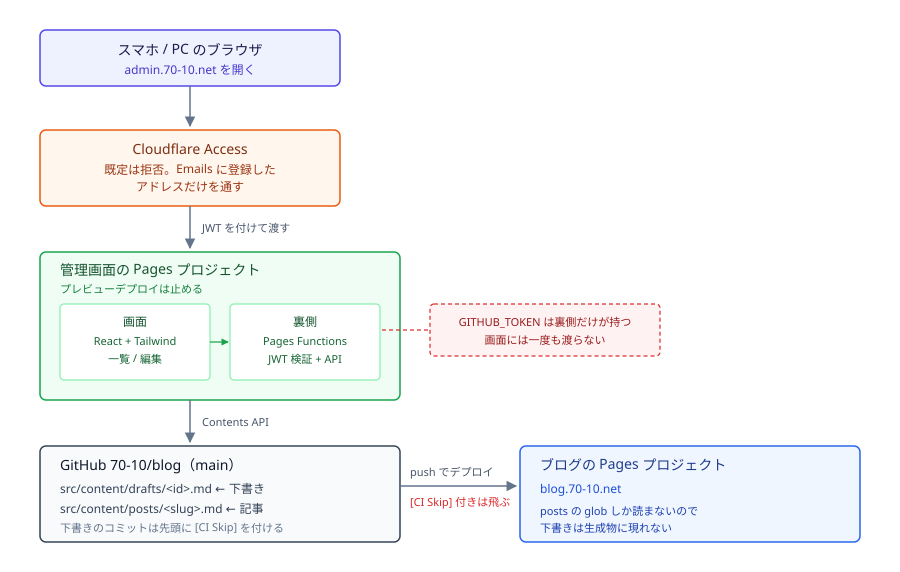

# 処理の流れ — draft-anywhere

上流は [00_intent.md](../../../00_intent.md)、[02_user-stories.md](../../../02_user-stories.md)（US-01 / US-03）、[explore/constraints.md](../explore/constraints.md)、[explore/design-decisions.md](../explore/design-decisions.md)。

構成は [ADR 0008](../../../../../adr/0008-admin-runs-as-its-own-pages-project-behind-cloudflare-access.md)、下書きの置き場は [ADR 0009](../../../../../adr/0009-drafts-live-outside-the-posts-collection-and-commit-with-a-build-skip-flag.md)。

## 処理フロー

### 全体



管理画面は状態を持たない。下書きの実体はリポジトリのファイルで、画面は表示と入力だけを受け持つ。

### 置き場（このリポジトリの中）

`packages/admin/` に新しいワークスペースパッケージを作る。

```
packages/admin/
├── package.json
├── vite.config.ts
├── index.html
├── src/            画面（React + Tailwind）
│   ├── main.tsx
│   ├── routes/     一覧・編集
│   └── lib/        画面から裏側を呼ぶ処理
├── functions/      Cloudflare Pages Functions（裏側）
│   └── api/
│       └── drafts/
└── shared/         画面と裏側で共有する型・下書きの読み書き
```

`packages/` を選んだのは、`tools/` が開発者の手元で動く道具（`create-post` の CLI、Markdown の変換）の置き場になっているのに対し、管理画面は配信されるアプリケーションだから。`pnpm-workspace.yaml` は既に `packages/*` を列挙しているので追記は要らない（[explore/constraints.md](../explore/constraints.md)）。

### 画面を開く

1. 利用者が管理画面のサブドメインを開く
2. **Cloudflare Access がリクエストを受け止める。** ポリシーは既定が拒否で、`Emails` に登録したアドレスだけを通す
3. 通ったリクエストにだけ Access が `Cf-Access-Jwt-Assertion` ヘッダーを付けて配信元へ渡す
4. 画面（静的なファイル）が返る

**画面側に認証の処理は無い。** 入口を守るのは Access で、アプリが確かめるのは裏側の API を呼ばれたときだけ（次項）。

### 裏側の API が呼ばれたとき（すべての経路で共通）

1. `Cf-Access-Jwt-Assertion` ヘッダーを取り出す。**無ければ 401**
2. JWKS（`<team>.cloudflareaccess.com/cdn-cgi/access/certs`）で署名を検証し、`iss` / `aud` / `exp` も確かめる。**通らなければ 401**
3. 各 API の処理に進み、GitHub Contents API を叩く

**手順 2 を省かない。** ヘッダーだけを見て中身を信じると別人になりすませる（[explore/constraints.md](../explore/constraints.md) の「管理画面の土台」）。JWKS は一度取った鍵を実行中だけ保持し、**鍵が見つからなければ取り直す**（6 週ごとに入れ替わるため）。

### 新しく書き始める

1. 利用者が「新しく書く」を選ぶ
2. 画面が空の編集画面を出す。**この時点ではまだファイルを作らない**
3. 利用者が本文かタイトルを打つ
4. 自動保存の合図が出る（下の「書き足す」）
5. 画面が `POST /api/drafts { title, body }` を呼ぶ
6. 裏側は両方が空なら 422 を返して終わる
7. 裏側が `id = crypto.randomUUID()` を作り、`src/content/drafts/<id>.md` の中身を組み立てる
8. 裏側が `PUT contents`（`sha` なし = 新規作成）を呼ぶ。コミットメッセージは `[CI Skip] chore(draft): add <id>`
9. 画面が URL を `/drafts/<id>` に差し替える。以後は更新の経路へ

**空の編集画面を開いただけではファイルを作らない。** US-01 の異常系「本文もタイトルも何も書いていないなら下書きは作られない」を、作ってから消すのではなく作らないことで満たす。

### 書き足す（自動保存）

1. 入力が変わる
2. 3 秒間、次の入力が無ければ発火する。**画面を離れるときとタブが隠れるときも発火する**
3. 前回保存した内容と同じなら何もしない
4. 本文もタイトルも空なら何もしない（[rules.md](rules.md) の「空になったとき」）
5. 画面が `PUT /api/drafts/<id> { title, body, sha }` を呼ぶ
6. 裏側が `updatedAt` を今の時刻にして中身を組み立て直し、`PUT contents`（`sha` つき）を呼ぶ。コミットメッセージは `[CI Skip] chore(draft): update <id>`
7. 裏側が新しい `sha` を返す
8. 画面が `sha` を差し替え、保存できたことを出す

**入力のたびにコミットしない。** 打つたびに GitHub へ書くと履歴が埋まり API の回数も増えるので、入力が止まってからまとめて 1 回にする。

**`[CI Skip]` を先頭に付ける。** Cloudflare Pages はこの印が先頭にあるコミットのデプロイを飛ばす（大文字小文字は問わない）。付けないと下書きを保存するたびにサイト全体が再ビルドされる。GitHub Actions は `pull_request` のときだけ動くので、`main` への直接のコミットでは走らない。

### 開き直す

1. 利用者が一覧から下書きを選ぶ。または `/drafts/<id>` を直接開く
2. 画面が `GET /api/drafts/<id>` を呼ぶ
3. 裏側が `GET contents` を呼び、Base64 を解いて frontmatter と本文に分ける
4. 画面がタイトルと本文を入力欄に入れ、`sha` を持っておく

**残したときの本文がそのまま入る**（US-02 の前提。書き継ぎ自体は Unit 2）。frontmatter を解いて本文を取り出すとき、本文には一切手を入れない。

### 一覧を出す

1. 画面が `GET /api/drafts` を呼ぶ
2. 裏側が `GET contents`（`src/content/drafts` ディレクトリ）を呼ぶ。ファイル名の一覧が返り、**中身は返らない**
3. 裏側が 1 件ずつ `GET contents` して frontmatter を読む
4. 裏側が `{ id, title, updatedAt }` の配列にして `updatedAt` の新しい順に並べる
5. 画面が一覧を出す。タイトルが空なら「（無題）」と出す

**ディレクトリが無いとき（下書きが 1 件も無いとき）は 404 が返る。** これを空の一覧として扱う。エラーにしない。

**1 件ずつ取りに行く回数は Unit 1 では受け入れる**（[data-model.md](data-model.md) の「GitHub Contents API とのやりとり」）。

## データフロー

### 値がどこからどこへ動くか

| 段           | 持ち主              | 中身                                                     |
| ------------ | ------------------- | -------------------------------------------------------- |
| 入力欄       | 画面（React state） | 打っている途中のタイトルと本文                           |
| 保存済みの印 | 画面（React state） | 最後に保存した内容と `sha`。差分の判定に使う             |
| 通信         | 画面 → 裏側         | JSON。認証の情報は乗せない（Access が付けた JWT を使う） |
| 資格情報     | 裏側のみ            | `GITHUB_TOKEN`。**画面には一度も渡らない**               |
| 実体         | GitHub              | `src/content/drafts/<id>.md`                             |

**トークンが画面に出ない**のがこの流れの要。画面から GitHub を直接叩かず、必ず裏側を通す（[ADR 0008](../../../../../adr/0008-admin-runs-as-its-own-pages-project-behind-cloudflare-access.md) で端末に鍵を持たせる案を却下した理由と同じ）。

### 下書きが生成物に出ない理由

1. `src/content.config.ts` の glob は `base: "./src/content/posts"` しか見ていない
2. よって `src/content/drafts/` は読まれず、`getPosts()` が返す配列に入らない
3. よって一覧・記事ページ・タグページ・RSS・OGP 画像のどれにも出ない

**絞り込む処理を足すのではなく、読まれない場所に置くことで満たす。** 5 つの生成物はすべて `getPosts()` を通る（[explore/constraints.md](../explore/constraints.md)）ので、`getPosts()` に入らなければそれで足りる。

### 検査の経路への影響

| 検査                     | 下書きが増えたときの影響                                                 |
| ------------------------ | ------------------------------------------------------------------------ |
| `pnpm build`             | 無い。posts の glob の外                                                 |
| `pnpm test:run`          | 無い                                                                     |
| `pnpm typecheck`         | 無い                                                                     |
| `pnpm lint:textlint`     | 無い。対象は `src/content/posts/**/*.md`                                 |
| `pnpm lint:eslint`       | 無い。Markdown は対象外                                                  |
| **`pnpm lint:prettier`** | **ある。`prettier . --check` が下書きも見る** → `.prettierignore` に足す |
| lefthook の pre-commit   | 無い。下書きは API 経由でコミットされ、手元の `git commit` を通らない    |

`.prettierignore` への追加を落とすと、スマホで書いた整形されていない文章で CI が落ちる（[ADR 0009](../../../../../adr/0009-drafts-live-outside-the-posts-collection-and-commit-with-a-build-skip-flag.md)）。

```

```
