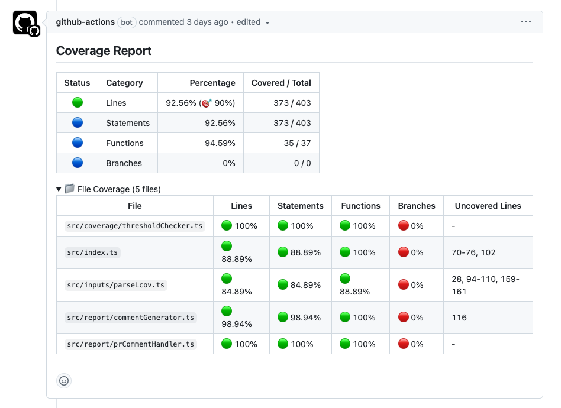

[vitest-coverage-report-action](https://github.com/marketplace/actions/vitest-coverage-report) `bun test` バージョンを作成しました。

https://github.com/marketplace/actions/bun-coverage-report

# 使い方

以下のように GitHub Actions のワークフローを作成します。
`bun test --coverage ---coverage-reporter=lcov --coverage-dir=coverage` を実行して、lcov 形式のカバレッジレポートを生成。出力された `coverage/lcov.info` を `70-10/bun-coverage-report-action` に渡し、GitHub のプルリクエストにカバレッジレポートをコメントします。

```yaml: .github/workflows/ci.yml
name: Coverage Report

on:
  pull_request:
    branches: [main]

jobs:
  coverage:
    runs-on: ubuntu-latest
    permissions:
      contents: read
      pull-requests: write

    steps:
      - name: Checkout
        uses: actions/checkout@v4

      - name: Setup Bun
        uses: oven-sh/setup-bun@v2
        with:
          bun-version: "1.2.x"

      - name: Install dependencies
        run: bun install --frozen-lockfile

      - name: Run tests with coverage
        run: bun test --coverage --coverage-reporter=lcov --coverage-dir=coverage

      - name: Coverage Report
        uses: 70-10/bun-coverage-report-action@v1.0.3
        with:
          lcov-path: coverage/lcov.info
          min-coverage: 80
```

Pull Request に以下のようにレポートされます。



# Claude Code にすべてを任せる

このツールの 99% は Claude Code に書いてもらいました。

自分が用意したのは、 ChatGPT o3 と壁打ちして作成した要件定義書の Markdown ファイルのみです。  
Claude Code にはその要件定義書をもとに作成してもらいました。

ほしいけど作るの面倒だなあと思ったものをすぐに作れる・作ってもらえる環境になったのはとても良いです。
