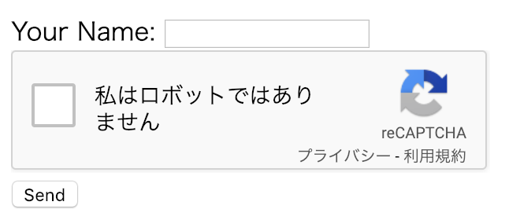

# はじめに

Netlify Forms の実装パターンについてまとめます。

# Netlify Forms の実装パターン

## 基本パターン

```html
<form name="basic" method="POST" data-netlify="true">
  <label>Your Name: <input type="text" name="name" /></label>
  <button type="submit">Send</button>
</form>
```

form メソッドに`data-netlify=true`属性を追加するだけで Netlify Forms が利用できます。  
submit すると form 内で定義された input の値が送信されます。  
送信が完了すると Netlify が用意する送信完了ページに遷移します。  
Netlify 側でスパム判定していて、怪しいリクエストと判断されると CAPTCHA での認証が求められます。

## 送信完了ページをカスタムする

```html
<form
  name="custom-success-page"
  method="POST"
  data-netlify="true"
  action="/success.html"
>
  <label>Your Name: <input type="text" name="name" /></label>
  <button type="submit">Send</button>
</form>
```

用意位した送信完了ページを使用するには、form の action 属性に URL パスを指定します。  
この例の場合では、送信完了後に `/success.html` へ遷移します。

## reCAPTCHA を強制する

```html
<form name="explicit-recaptcha" method="POST" data-netlify="true">
  <label>Your Name: <input type="text" name="name" /></label>
  <div data-netlify-recaptcha="true"></div>
  <button type="submit">Send</button>
</form>
```

form の子要素に `data-netlify-recaptcha="true"` 属性を持つ DOM を追加すると、reCAPTCHA 2 を埋め込めます。  
基本パターンは、submit 後に CAPTCHA 画面が出ますが、こちらは form 自身に reCAPTCHA 2 が埋め込まれるため、遷移数が少なくなります。



## ハニーポットを設定する

```html
<form
  name="honeypot"
  method="POST"
  data-netlify="true"
  netlify-honeypot="bot-field"
>
  <p>
    <label>Bot Field: <input name="bot-field" /></label>
  </p>
  <label>Your Name: <input type="text" name="name" /></label>
  <button type="submit">Send</button>
</form>
```

form に `netlify-honeypot="<ハニーポット用フィールド名>"` を追加します。form の子要素として `name="<ハニーポット用フィールド名>"`をもつ input タグを追加します。例ではハニーポット用フィールド名として`bot-field`を使用しています。  
ハニーポット用フィールド名をもつ input に値が設定された状態で submit した場合、その送信情報をスパムと判定します。スパムと判定されても送信完了画面に遷移しますが、実際に内容は送信されません。  
ハニーポット用の input は css や js で画面上から見えないように設定する必要があります。

# 基本パターン・reCAPTCHA・ハニーポットのどれを使うべきか

ほとんどの場合は基本パターンで問題ないです。  
基本パターンのデメリットとして、送信までに CAPTCHA ページへの遷移が 1 つ増えることです。また CAPTCHA ページはカスタマイズできません。"Sorry to Interrapt"と書かれた英語のページが出ます。  
サイトを利用するユーザーのリテラシーが低い場合、急に英語の画面が出てきた！と驚かれる可能性があります。その場合は reCAPTCHA を利用するのがベターでしょう。  
ハニーポットパターンをあえて使うことはないでしょう。

# ドキュメント

- [Netlify Forms のサンプルページ](https://forms-sample.netlify.com/)
- [GitHub リポジトリ](https://github.com/70-10/netlify-forms-sample)
- [Netlify のドキュメント](https://www.netlify.com/docs/form-handling/)
