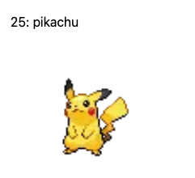

Next.js で API リクエストを行う方法 3 つのパターン例をまとめます。  
それぞれの方法で、[PokeAPI](https://pokeapi.co/) を使ってピカチュウの情報を取得してみます。

サンプルコードはこちらに置いています。  
[70-10/nextjs-api-request](https://github.com/70-10/nextjs-api-request)

# API にリクエストする 3 つのパターン

1. CSR (Client-side Rendering)
   - ページのレンダリングをブラウザで行う
   - API リクエストはブラウザから行われる
2. SSR (Server-side Renderring)
   - ページのレンダリングをサーバーで行う
   - API リクエストはサーバーから行われる
3. SSG (Static-site Generation)
   - ページのレンダリングをビルド時に行う
   - API リクエストはビルドを実行処理のなかで行われる

|  |
| :----------------------------------------------------------------------------: |

実装イメージはこんな感じ。図鑑番号と名前、画像が表示されるというシンプルなもの。

# 1. CSR (Client-side Rendering)

```tsx
import type { Pokemon } from "@/models/pokemon";
import Image from "next/image";
import useSWR from "swr";

const pokeapiUrl = "https://pokeapi.co/api/v2/pokemon/25";
const fetcher = (url: string) => fetch(url).then((res) => res.json());

export default function CSR() {
  const { data, error, isLoading } = useSWR<Pokemon>(pokeapiUrl, fetcher);

  return (
    <main>
      <h2>CSR (Client-side Rendering)</h2>
      {error && <p>Failed to load</p>}
      {isLoading && <p>Loading...</p>}
      {data && (
        <>
          <p>
            {data.id}: {data.name}
          </p>
          <Image
            src={pokemon.sprites.front_default}
            width={200}
            height={200}
            alt="Picture of the author"
          />
        </>
      )}
    </main>
  );
}
```

# 2. SSR (Server-side Renderring)

```tsx
import type { Pokemon } from "@/models/pokemon";
import type { GetServerSideProps, InferGetServerSidePropsType } from "next";
import Image from "next/image";

const pokeapiUrl = "https://pokeapi.co/api/v2/pokemon/25";

interface Props {
  pokemon: Pokemon;
}

export default function SSR({
  pokemon,
}: InferGetServerSidePropsType<typeof getServerSideProps>) {
  return (
    <main>
      <h2>SSR (Server-side Rendering)</h2>
      <p>
        {pokemon.id}: {pokemon.name}
      </p>
      <Image
        src={pokemon.sprites.front_default}
        width={200}
        height={200}
        alt="Picture of the author"
      />
    </main>
  );
}

export const getServerSideProps: GetServerSideProps<Props> = async (
  context,
) => {
  const res = await fetch(pokeapiUrl);
  const pokemon = (await res.json()) as Pokemon;

  return {
    props: {
      pokemon,
    },
  };
};
```

# 3. SSG (Static-site Generation)

```tsx
import type { Pokemon } from "@/models/pokemon";
import type { GetStaticProps, InferGetStaticPropsType } from "next";
import Image from "next/image";

const pokeapiUrl = "https://pokeapi.co/api/v2/pokemon/25";

interface Props {
  pokemon: Pokemon;
}

export default function SSG({
  pokemon,
}: InferGetStaticPropsType<typeof getStaticProps>) {
  return (
    <main>
      <h2>SSG (Static-site Generation)</h2>
      <p>
        {pokemon.id}: {pokemon.name}
      </p>
      <Image
        src={pokemon.sprites.front_default}
        width={200}
        height={200}
        alt="Picture of the author"
      />
    </main>
  );
}

export const getStaticProps: GetStaticProps<Props> = async (context) => {
  const res = await fetch(pokeapiUrl);
  const pokemon = (await res.json()) as Pokemon;

  return {
    props: {
      pokemon,
    },
  };
};
```
