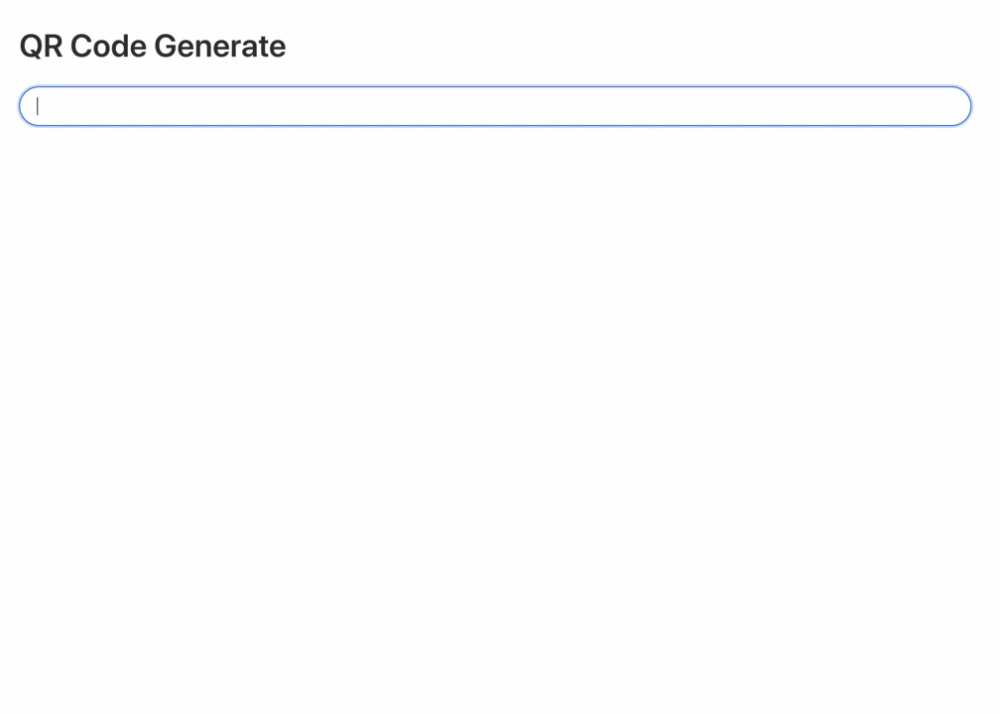

フロントエンドで QR コードを生成する処理が業務で必要だったので、調査がてら QR コードジェネレーターを作成しました。

https://qr-generate.now.sh

|  |
| :-----------------------------------------------------: |

フレームワークには[GatsbyJS](https://www.gatsbyjs.org/)を、QR の生成には[qrcode.react](https://github.com/zpao/qrcode.react)を使用しています。  
qrcode.react はとても簡単で、QR コードにしたい文字列を `value` へ渡すだけです。

```jsx
import React from "react";
import QRCode from "qrcode.react";

export default () => <QRCode value="http://qr-generate.now.sh" />;
```
