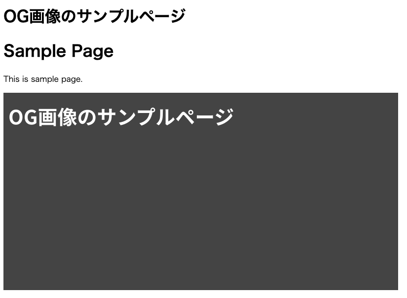

[satori](https://github.com/vercel/satori) と [sharp](https://sharp.pixelplumbing.com/)を使って、Astro で記事ごとに OG 画像を自動で生成する仕組みを作りました。

以下のように画像が表示されます。

<blockquote class="twitter-tweet"><p lang="ja" dir="ltr">Astro を色々試している。<a href="https://t.co/FhdsdfdTRw">https://t.co/FhdsdfdTRw</a></p>&mdash; 70_10 (@70_10) <a href="https://twitter.com/70_10/status/1626562972570251264?ref_src=twsrc%5Etfw">February 17, 2023</a></blockquote> <script async src="https://platform.twitter.com/widgets.js" charset="utf-8"></script>

# satori とは

`satori` とは、HTML/CSS を SVG に変換するツールです。  
[`@vercel/og`](https://vercel.com/docs/concepts/functions/edge-functions/og-image-generation) という、動的に OG 画像を生成するライブラリの中で使用されています。

# OG 画像が生成されるまでの処理の流れ

1. OG 画像用の HTML を作成
2. satori で HTML を SVG に変換
3. sharp で SVG から PNG に変換
4. PNG を [静的ファイルエンドポイント](https://docs.astro.build/core-concepts/endpoints/#static-file-endpoints)として配信

# 実装内容

以下の手順で実際に実装していきます。

0. Astro プロジェクトを用意
1. 必要なパッケージのインストール
2. Astro に React を追加
3. `pages/og/[slug].png.ts` を作成
4. `getOgImage(title: string)` を作成
5. meta データの設定

# 0. Astro プロジェクトを用意

## 0.1 コマンドで Astro プロジェクトを生成

以下のコマンドで、Astro プロジェクトを用意します。

```
npm create astro@latest
```

コマンドを実行すると設定を聞かれるので、TypeScript のスタータープロジェクトを選択します。  
作成すると以下のような構成のプロジェクトが生成されます。

```
.
├── README.md
├── astro.config.mjs
├── package-lock.json
├── package.json
├── public
│   └── favicon.svg
├── src
│   ├── components
│   │   └── Card.astro
│   ├── env.d.ts
│   ├── layouts
│   │   └── Layout.astro
│   └── pages
│       └── index.astro
└── tsconfig.json
```

## 0.2 ContentCollection の用意

OG 画像を生成するもととなるページ (`/posts/[slug]`)を ContentCollection を使って用意します。  
以下の 3 つのファイルを作成します。

```markdown:src/content/posts/sample.md
---
title: OG画像のサンプルページ
---

# Sample Page

This is sample page.
```

```ts:src/content/config.ts
import { defineCollection, z } from "astro:content";

const postsCollection = defineCollection({
  schema: z.object({
    title: z.string(),
  }),
});

export const collections = {
  posts: postsCollection,
};

```

```astro:src/pages/posts/[slug].astro
---
import { CollectionEntry, getCollection } from "astro:content";

interface Props {
  post: CollectionEntry<"posts">;
}

export async function getStaticPaths() {
  const posts = await getCollection("posts");
  return posts.map((post) => ({
    params: { slug: post.slug },
    props: {
      post,
    },
  }));
}

const { post } = Astro.props;
const { Content } = await post.render();
---

<!DOCTYPE html>
<html lang="ja">
  <head>
    <meta charset="UTF-8" />
  </head>
  <body>
    <h1>{post.data.title}</h1>
    <Content />
  </body>
</html>
```

## 1. 必要なパッケージのインストール

OG 画像生成に必要なパッケージ、 `satori` と `sharp` をインストールします。

```
npm install satori sharp
```

TypeScript を使用しているので、 `@types/sharp` もインストールします。

```
npm install -D @types/sharp
```

## 2. Astro に React を追加

OG 画像にする HTML を jsx で書くため、Astro に React を導入します。

```
npx astro add react
```

## 3. `pages/og/[slug].png.ts` を作成

Astro の静的ファイルエンドポイント `pages/og/[slug].png.ts` を作成します。  
OG 画像を生成する、 `getOgImage(title: string)` の作成は次の工程で行います。

```ts:src/pages/og/[slug].png.ts
import type { APIContext } from "astro";
import { getCollection, getEntryBySlug } from "astro:content";
import { getOgImage } from "../../components/OgImage";

export async function getStaticPaths() {
  const posts = await getCollection("posts");

  return posts.map((post) => ({
    params: { slug: post.slug },
  }));
}

export async function get({ params }: APIContext) {
  const post = await getEntryBySlug("posts", params.slug);
  const body = await getOgImage(post?.data.title ?? "No title");

  return { body, encoding: "binary" };
}
```

## 4. `getOgImage(title: string)` を作成

`getOgImage(title: string)` をもつ `OgImage.tsx` を作成します。  
`getFontData()` は [satori/font.ts at main · vercel/satori](https://github.com/vercel/satori/blob/main/playground/pages/api/font.ts) を参考に作成しています。

```tsx:src/components/OgImage.tsx
import satori from "satori";
import sharp from "sharp";

export async function getOgImage(text: string) {
  const fontData = (await getFontData()) as ArrayBuffer;
  const svg = await satori(
    <main
      style={{
        height: "100%",
        width: "100%",
        backgroundColor: "#444",
        color: "#fff",
        padding: "10px",
      }}
    >
      <section>
        <h1 style={{ fontSize: "40px" }}>{text}</h1>
      </section>
    </main>,
    {
      width: 800,
      height: 400,
      fonts: [
        {
          name: "Noto Sans JP",
          data: fontData,
          style: "normal",
        },
      ],
    }
  );

  return await sharp(Buffer.from(svg)).png().toBuffer();
}

async function getFontData() {
  const API = `https://fonts.googleapis.com/css2?family=Noto+Sans+JP:wght@700`;

  const css = await (
    await fetch(API, {
      headers: {
        "User-Agent":
          "Mozilla/5.0 (Macintosh; U; Intel Mac OS X 10_6_8; de-at) AppleWebKit/533.21.1 (KHTML, like Gecko) Version/5.0.5 Safari/533.21.1",
      },
    })
  ).text();

  const resource = css.match(
    /src: url\((.+)\) format\('(opentype|truetype)'\)/
  );

  if (!resource) return;

  return await fetch(resource[1]).then((res) => res.arrayBuffer());
}
```

## 5. meta データの設定

`astro-seo` を使って設定します。  
 まずは `astro-seo` をインストールします。

```
npm install astro-seo
```

`src/pages/posts/[slug].astro` に `astro-seo` を追加します。

```astro:src/pages/posts/[slug].astro
---
import { SEO } from "astro-seo";
import { CollectionEntry, getCollection } from "astro:content";

interface Props {
  post: CollectionEntry<"posts">;
}

export async function getStaticPaths() {
  const posts = await getCollection("posts");
  return posts.map((post) => ({
    params: { slug: post.slug },
    props: {
      post,
    },
  }));
}

const { post } = Astro.props;
const { Content } = await post.render();
---

<!DOCTYPE html>
<html lang="ja">
  <head>
    <SEO
      charset="UTF-8"
      openGraph={{
        basic: {
          title: post.data.title,
          type: "article",
          image: new URL(`/og/${post.slug}.png`, Astro.url.origin).toString(),
        },
        image: {
          alt: post.data.title,
        },
      }}
    />
  </head>
  <body>
    <h1>{post.data.title}</h1>
    <Content />
  </body>
</html>
```

# 実装の確認

`npm run dev` でローカル実行をし、`http://localhost:3000/posts/sample` にアクセスすると以下のように表示されます。

|  |
| :--------------------------------------------------------------: |

生成された OG 画像は `http://localhost:3000/og/sample.png` から確認できます。

# サンプルアプリ

実際に実装したサンプルアプリはこちらです。  
[70-10/astro-og-sample](https://github.com/70-10/astro-og-sample/tree/main)

# 参考記事

- [HTML/CSS を SVG に変換する Vercel 製のパッケージ「satori」を試してみる](https://zenn.dev/kou_pg_0131/articles/satori-usage)
- [Next.js Conf 2022 で最も感動したライブラリ、vercel/satori について紹介させてください。 - commmune Engineer Blog](https://tech.commmune.jp/entry/2023/01/24/113000)
- [Satori + SvelteKit で OGP 画像を自動生成する](https://azukiazusa.dev/blog/satori-sveltekit-ogp-image/)
